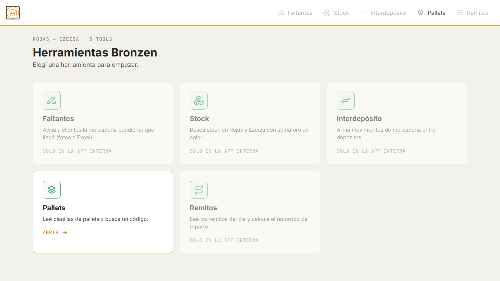
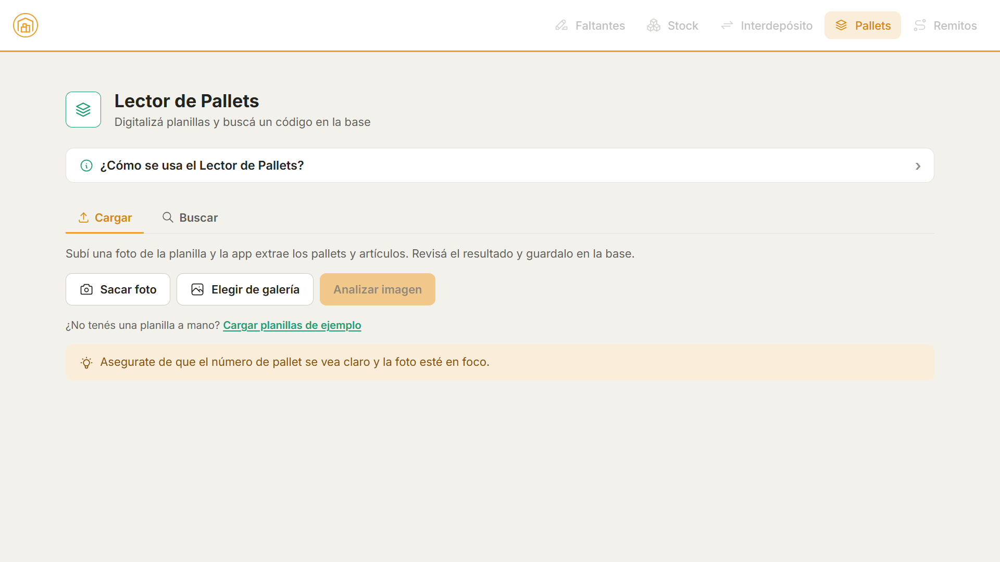
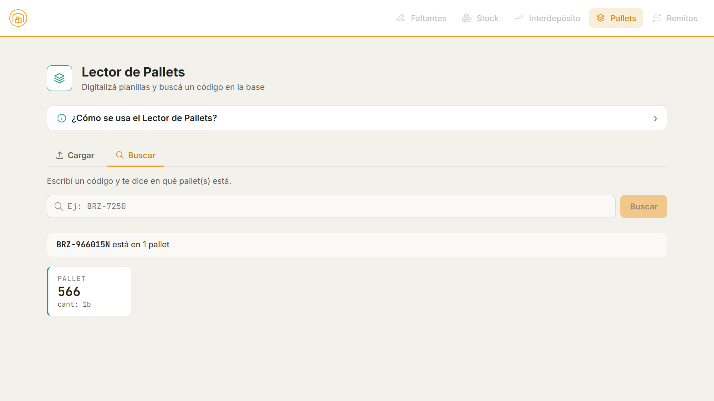

# Bronzen-app — AI Automation for Warehouse Logistics

> An AI automation toolkit built for the warehouse operations of an importing
> company. Tools that turn manual processes — handwritten notes, Excel files,
> paper delivery sheets — into structured outputs. Used daily by 10–20 employees.

**Live**: [bronzen-app.web.app](https://bronzen-app.web.app) *(internal tool, demo access on request)*
**Portfolio case study**: [tomassitta.com/#bronzen](https://tomassitta.com)



---

## About this repository

This repo is a **curated, runnable showcase** of Bronzen-app. The full
production codebase is private — it handles real operational data and the
deployed version is internal.

Unlike a typical read-only code dump, **this slice actually runs**: it's the
front end of the **Pallets** module, wired to run **100% offline against demo
data** — no backend, no Firebase, no API keys.

```bash
npm install
npm run dev      # → http://localhost:5173
```

All data here is **synthetic** — no real client names, addresses, products or
operational records are exposed.

---

## What Bronzen-app is

Bronzen-app is the operational toolkit I built for the warehouse and logistics
team at an importing company that distributes home hardware and electronics
(locks, hinges, mirrors, smart trash bins, biometric safes — hundreds of SKUs of
metal and aluminum-based products for households).

The warehouse runs on physical paper: handwritten pick lists, highlighted notes,
printed packing slips, paper delivery receipts. The opportunity I kept finding
was the same — wherever there was a manual step between paper and Excel, an AI
vision model could compress it into seconds.

It started in November 2024 with a single tool, **Remitos**, a delivery-note
reader that turned a stack of paper receipts into an optimized route. From there
it kept growing — each new tool added in response to a specific pain point raised
by the warehouse manager. Six tools later, it's used daily by ~10–20 employees.

---

## The toolkit

| Tool             | What it does |
|------------------|--------------|
| **Remitos**      | Reads photographed delivery notes, extracts addresses with Gemini Vision, geocodes them and computes the delivery route (distances + times) with Google Maps. |
| **Faltantes**    | Reads a photo of a pick list where missing items are highlighted, extracts only the highlighted rows, cross-references arriving stock, and drafts client-ready messages. |
| **Stock**        | Live stock search across two warehouses, reading a shared Google Sheet, with a traffic-light availability indicator. |
| **Interdepósito**| Reads a photographed transfer list and produces structured records of merchandise moving between warehouses. |
| **Pallets**      | Reads pallet manifests by photo, stores them in Firestore, and lets the team look up which pallet a given code is on. **← the module showcased in this repo.** |
| **Pendientes**   | Turns an Excel of pending orders into per-client messages. In the unified app it lives inside **Faltantes** (the Excel flow), which is why the home shows five entries. |

---

## Architecture decision: the refactor

By the third tool I noticed the pattern: each had been built as its own Cloud Run
service — its own deploy, its own URL, its own cold start. The team was juggling
several links to do their job.

I refactored the services into a **single Flask application** on Cloud Run, each
tool living under a route prefix (`/faltantes`, `/remitos`, `/pallet`, …). Net
effect:

- One URL instead of several.
- Lower cold starts — one warmed container serves every tool.
- Simpler deploys: a single push updates the whole toolkit.
- One unified front end served alongside the API.

A small decision, but the kind that pays compound interest: each new tool now
ships as a new route, not a new service.

---

## This showcase: the Pallets module — `src/modules/Pallet.jsx`

Pallets is the most complete tool end-to-end, which is why it's the one made
runnable here: a photo of a **handwritten pallet sheet** → vision OCR → database
→ a code lookup with autocomplete. It exercises the widest range of real
problems.

**What runs in this repo**

- **Upload & analysis** — multi-image upload (camera or gallery), thumbnails,
  loading/error states, review before saving. A **"Load sample sheets"** shortcut
  loads two synthetic handwritten manifests so you can try it without a photo of
  your own.
- **Search with autocomplete** — Google-style prefix suggestions with debounce
  and highlighting of the typed portion.
- **Excel export** — generated client-side (SheetJS) in the showcase.

**The demo / production seam — [`src/services/palletApi.js`](src/services/palletApi.js)**

The component never calls `fetch` or touches Firestore. It always goes through
this module:

```js
export async function buscar(codigo) {
  if (DEMO_MODE) return { resultados: buscarPorCodigo(indice, codigo) }; // local
  // production: GET /pallet/buscar?codigo=...  (Flask + Firestore)
}
```

Because the demo data has the same shape the backend returns, no `if (demo)`
branch ever leaks into the UI — the same screen runs against the real Flask API
by flipping one constant.

**Domain logic ported to pure JS — [`src/demo/palletStore.js`](src/demo/palletStore.js)**

Code normalization, exact lookup, prefix autocomplete and natural pallet ordering
are a pure-JS port of the production backend (`pallet_db.py` over Firestore),
isolated so the rule set is the single source of truth and testable without a
network.

**Layout**

```
src/
  modules/Pallet.jsx        the module UI (upload, analyze, search)
  services/palletApi.js     the only seam between UI and data
  demo/
    palletStore.js          pure search/autocomplete logic (port of pallet_db.py)
    demoData.js             synthetic pallets + sample-sheet map
  styles/                   design tokens + shared primitives (Sass)
public/samples/             two synthetic handwritten pallet sheets
```

In production the OCR is **Gemini Vision** with a heavily tuned prompt (visual
block detection, multi-column sheets, discarding crossed-out / highlighted lines,
fixing confusable digits), and persistence is **Firestore** with deterministic
IDs so re-uploading a sheet never duplicates rows.

---

## Stack

**This showcase** — React 19 · Vite · React Router · SheetJS (xlsx) · Tabler
icons · hand-written Sass (no UI framework). Runs offline, no backend.

**Bronzen-app (production)** — the context the showcase is carved from:

| Layer               | Technology                  |
|---------------------|-----------------------------|
| Frontend            | React                       |
| Backend             | Python (Flask)              |
| Cloud               | Google Cloud (Cloud Run)    |
| Database            | Firestore                   |
| Inventory data      | Google Sheets API           |
| AI                  | Gemini Vision API           |
| Geocoding & routing | Google Maps API             |
| Hosting             | Firebase Hosting (frontend) |

---

## Screenshots

*All screenshots use synthetic demo data.*


*The unified entry point. In this showcase only Pallets is navigable; the rest is
dimmed to show the full design system.*


*Pallets: a handwritten sheet read into structured pallets, ready to save or export.*


*Pallets: looking up which pallet a code is on, with prefix autocomplete.*

---

## Running locally

```bash
git clone https://github.com/tomsrsitta/bronzen-app-showcase
cd bronzen-app-showcase
npm install
npm run dev      # → http://localhost:5173
```

Everything runs offline against the synthetic fixtures in `src/demo` — no
secrets or services required.

---

## Project status

Bronzen-app has been in active production use by the warehouse team since November
2024 and keeps growing — new modules ship as new pain points emerge.

Built solely by **Tomás Rodrigo Sitta**, from a personal request by the warehouse
manager into the operational toolkit of the team.

---

## Author

**Tomás Rodrigo Sitta**
AI Product Builder | FullStack Developer | Designer

[LinkedIn](https://linkedin.com/in/tomas-sitta) · [Portfolio](https://tomassitta.com) · [Behance](https://behance.net/tomsrsitta) · [Email](mailto:410toms@gmail.com)

---

## License

MIT — see [LICENSE](./LICENSE). The showcase code is open for reading and
learning; the full production codebase remains private.
